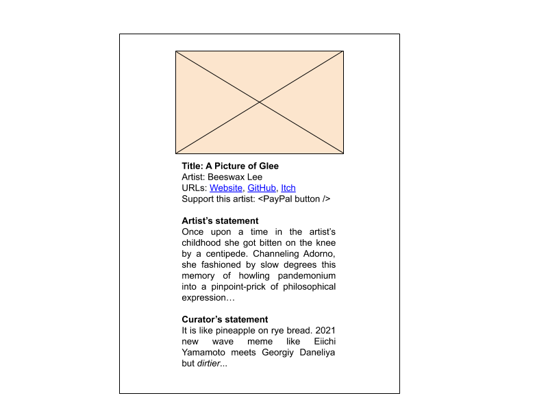
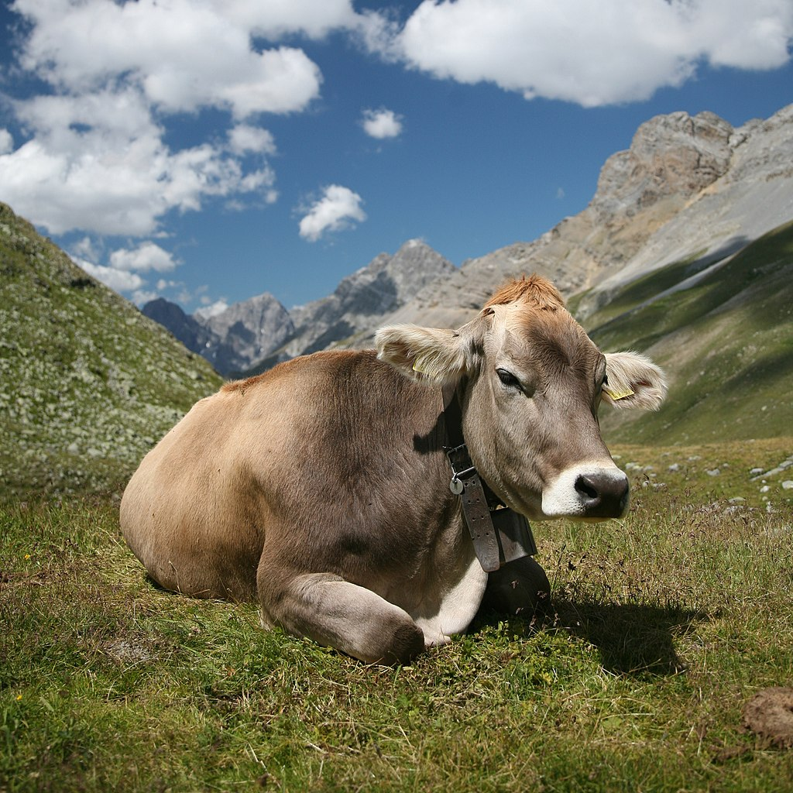

<h1>Call for Artworks</h1>

  

<h3>Supermeowkat</h3>

  

<h3>presents</h3>

  

<h1>Untitled Cow Exhibition</h1>

  

# Themes

_(simplified version below)_

The Udder is the fount of contemporary sensuousness. Betwixt teat and lip, it is distended into supply chains like veins wrapped once, twice, thrice, and again around the world, from factory farm to supermarket to the cardboard taste of carton-flavoured milk, 3.5% fat. That taste, memory of mammary, a moment submerged in the lost comfort of the amniotic sac. We sate in it. Once the Udder is depleted, our own expression is to send it to the abattoir.

In this rumination, our bovine turn metastasizes the Udder under post-speculative conditions of production allegorical to the -pocene. It is a nightmare netherworld a fraction of a degree off to the anthro-. The existence of the Udder is denied by an aversion of eyes. Hiding in that slim crack of realisation, affordance of imagination portends threat of slippage, sudden and savage.

In exoticising the Udder do we sublimate criticality in favour of our matriphagous fangs? Whether surrender to hedonistic madness or diagnostic interpretation, we bid you to indulge and wallow in the aftertaste. There have never been easy answers.

# Simplified

The cow is a sorry animal. We farm it in factory conditions, and use it for milk and meat. The supply chain bringing it from factory farm to our table is global, complex, very long, and full of possible problems. It is an ugly assembly line. But milk tastes so good, like memory of a secure loving childhood.

The cow’s nightmarish experience mirrors our own. We, too, are part of an assembly line. However, we actively avoid thinking about the cow. If we were to think of it, we might find it too horrible a realisation to deal with. It might break us. This is how we deal with the terrifying issues facing us today, such as climate change, hegemony, corruption, etc. We actively avoid thinking about them.

Are we being selfishly indulgent by enriching the cow and its udder with so much meaning? Is there a point to this? Life is full of difficult questions.

# Even more simplified

Poor cows. :(

Humans, why?

---

# What

A modest online exhibition with digital works only.

# When

Open call: 10 Jan - 20 Feb 2020

Artists notified by: 15 Mar 2020

Exhibition: 1 Apr - 30 Jun 2020

# Where

Right here on this website.

# How

I will pick 12 submissions. If I even get that many.

These will be displayed on a single plain webpage with your art in a column one after another. Something like this:

I might make it look prettier if I have more time. Make it look less catalogue, more white cube?

# Why

It's lonely out here. If we can build relationships on the internet, let's do it!

It's also a nice exercise to see how far we can push this format, especially if people send in code art. Just coding this website with Gatsby alone showed me how to embed videos in markdown, which can't be done with pure markdown. Pretty cool.

What happens if people send in a Jupyter notebook of statistics art? What if it's a set of JavaScript functions? What if it's a live performance art piece from a farm? I think there's a lot to explore here, if people even send in anything. Most of it won't be of interest to the casual viewer. But to curators and tech folks, it might be something.

Also, cows!

---

# Submission requirements

Mail submissions to alexalexyang@gmail.com.

## General requirements

- Must be related to themes you can glean from the description above
- Ideally should involve cows somehow or udder, although I'll take a somewhat relaxed approach to this
- Only digital materials
- Write a description for it
- Textual requirements like description and your details should be sent in your email body or in a doc, odt, or txt file from which it can be easily copied. Do NOT send them in a PDF. It often prevents easy copy-pasting.

## Allowed formats

- Image:
  - gif, png, jpg, svg
  - max size: 1mb
- Video:
  - Put it on YouTube/Vimeo
  - Send me the embed URL
- Game:
  - Put it on itch.io, GitHub, or GitLab
  - Make sure installation requirements are clear
  - Send me an image and the URL
- Code:
  - This site is written with Gatsby, so if your artwork involves JavaScript, it might be possible. No guarantees but we should discuss this.
  - Jupyter notebooks are possible thanks to [gatsby-transformer-ipynb](https://www.gatsbyjs.org/packages/@gatsby-contrib/gatsby-transformer-ipynb/), so, send in statistics art or whatevs
  - I don’t know about other languages for now. Maybe in future with WebAssembly.
- Website:
  - Send me image and URL
- Performance
  - No idea how this might work. Is it performance art, or live art as people seem to call it in the UK? Is it for launch night/day? Do we need a Discord channel for it? Do you want to give a tour of an abattoir? Should it be streamed on YouTube? It's wide open. Let's discuss and see how it goes.
- Other formats:
  - If it’s not more than 5 min of work for me we’ll probably do it
  - Do you want to hold workshops, pop-up shows, or whatever on-site where you are in conjunction with Untitled Cow Exhibition? It's a possibility. Text us.

## Also need your details

- Name
- Email address
- Artist profile
- Whatever URLs you want, eg: personal website, GitHub, itch.io, Patreon, ko-fi, Behance, Mastodon, LinkedIn, etc
- PayPal email, in case people want to encourage you with pennies but don’t count on it

---

# Fees

None!

# Payment

Also none! This is just for fun.

I’ll put a PayPal button under each artwork so people can encourage the artist directly if they feel like it. I doubt they would though.

---

# Outreach

I’ll just post it on my Twitter, Mastodon, and Diaspora. And email it to friends. This is a tiny operation.

Tell me if there are places we can submit this to in order to gain more eyeballs.

I’m not putting this on Facebook and Instagram because the company allows hate groups on its platforms. You can do it if you like though.

---

# Curators

I’ll curate it with a winning combination of my botched art historical training and the violence of my whims. Mainly the latter.

And maybe a couple of other people. Idk.

---

# What happens afterwards

I’ll delete or empty the site.

I’ll probably keep screenshots and the website code, and the images if artists allow it. The code will retain links to the videos but I won’t keep the videos themselves.

---

# Tech

For those interested in the tech, this is a markdown-focused Gatsby site with Google Analytics. It’ll be deployed to Netlify so some rate limiting applies but I’m not expecting a billion people to descend on the website anyway.

The code is on [GitHub](https://github.com/alexalexyang/supermeowkat), free to clone/fork for your own nefarious purposes.

I’d use only FOSS tools if I could. Not free as in beer, which I never understood. I don’t drink alcohol. Free as in I don’t have to pay a cent for it. Tell me if you know a good FOSS analytics tool.
